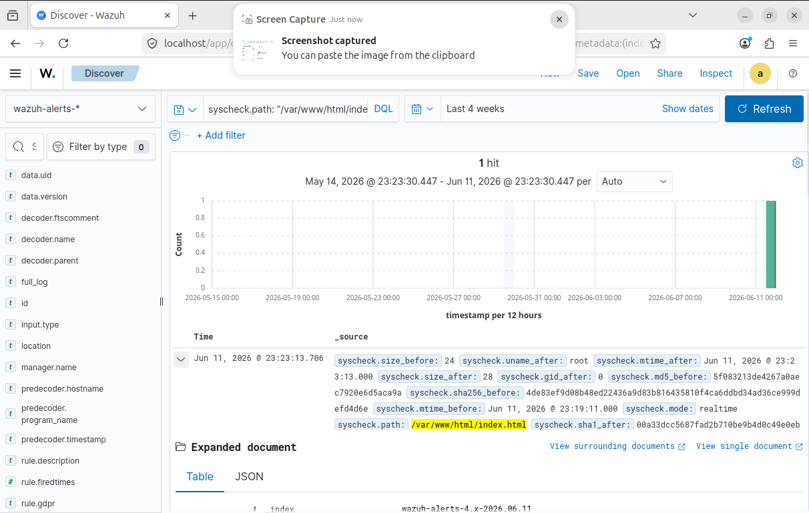
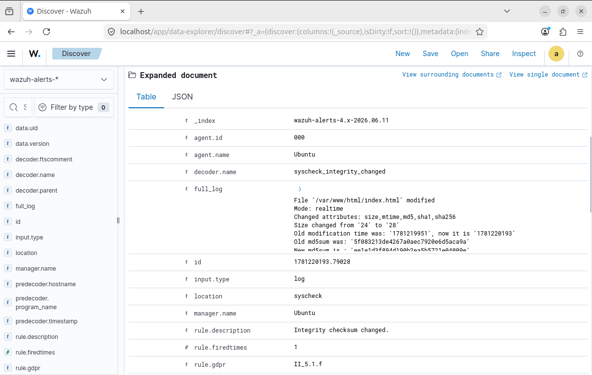
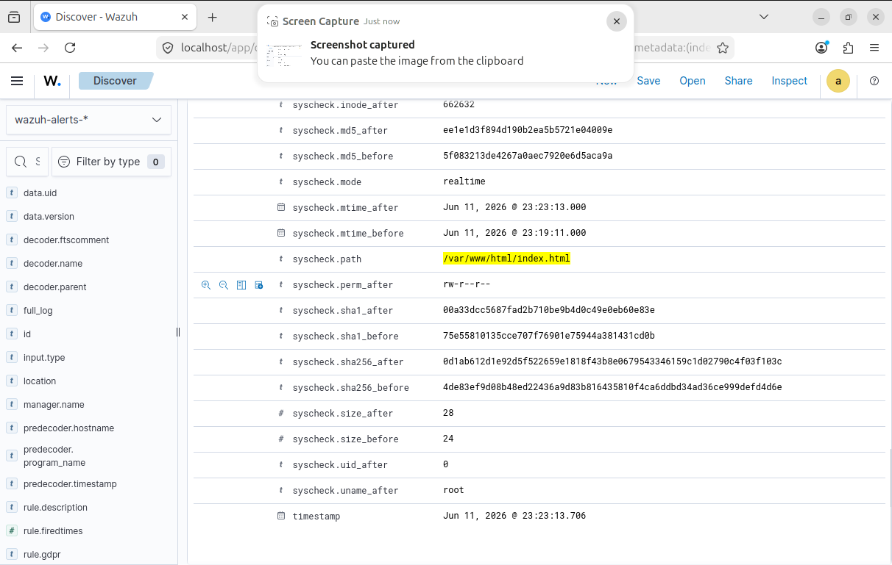
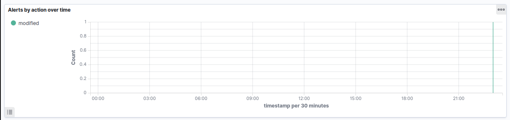

# Enterprise Threat Detection & Architectural Engineering Portfolio
**Author:** Joshua Langley  
**Objective:** Practical design, configuration, and verification of automated defensive alert pipelines, network forensics, and host integrity baselines.

---

## Lab 1: Host-Based Threat Detection & Network Packet Analysis

### Executive Summary
A simulated authentication attack was executed against an isolated Linux local node to validate endpoint logging capabilities within the Wazuh SIEM/XDR platform and cross-examine network traffic anomalies using Wireshark. The objective was to successfully log, analyze, and document an unauthorized access attempt mimicking automated credential probing.

### Topology & Tools
- **Operating System:** Ubuntu Linux VM
- **SIEM Engine:** Wazuh Architecture (Single-Node Stack)
- **Network Analyzer:** Wireshark Packet Inspection
- **Targeted Protocol:** SSH (Port 22)

### Phase 1: Host-Based Log Telemetry (Wazuh SIEM)
Upon executing an unauthenticated access sequence targeting non-existent system accounts, the Wazuh analysis engine successfully triggered an Alert Level 5 security flag. This event correlates directly with **MITRE ATT&CK Technique T1110 (Brute Force)**.

#### Telemetry Evidence
*(Note: Refer to local project documentation repository for associated endpoint authentication capture logs).*

### Phase 2: Deep Packet Forensic Investigation (Wireshark)
To cross-reference host logs with raw network data, network layer analysis was initiated to monitor traffic anomalies. The targeted connection requests—occurring systematically within milliseconds—characterize automated script activity rather than a standard human authentication error.

---

## Lab 2: Real-Time File Integrity Monitoring (FIM) & Security Metrics

### Executive Summary
This phase involved configuring and verifying an automated File Integrity Monitoring (FIM) detection pipeline utilizing the Wazuh SIEM/XDR architecture. By establishing active directory tripwires on high-value file systems (`/var/www/html`), the environment successfully identified unauthorized file modifications and system configuration drifting in real-time.

### Tools & Environment
- **SIEM Engine:** Wazuh XDR Architecture
- **Target Host:** Ubuntu Linux Node (Agent 000)
- **Core Technology:** FIM (File Integrity Monitoring / Syscheck Engine)

### Phase 1: Real-Time Tampering Detection
An unauthorized data injection attack was simulated against the host's web directory assets. The Wazuh file integrity monitoring engine detected the modification within seconds of execution, tracking cryptographic change metrics.

#### Forensic Telemetry Evidence

**Key Forensic Data Extracted (Rule 550 / MITRE T1565.001):**
- **Monitored Object:** `/var/www/html/index.html`
- **Triggered Event:** File Modified / Integrity Checksum Changed
- **Pre-Attack MD5:** `5f083213de4267a0aec7920e6d5aca9a`
- **Post-Attack MD5:** `ee1e1d3f894d190b2ea5b5721e04009e`
- **Defensive Alignment:** Maps directly to **Stored Data Manipulation** tactics, providing immediate detection against malicious website defacement or backdooring.

#### Metadata Attribute Inspection

The detailed metadata view proves full audit tracking down to the exact filesystem attributes, including file size drift (from 24 to 28 bytes) and real-time modification timestamps (`Jun 11, 2026 @ 23:23:13.706`).

### Phase 2: Centralized Telemetry Dashboarding
System-wide behavioral metrics were evaluated using the centralized SIEM reporting dashboard to isolate real-time activity anomalies from standard baseline system behavior.

#### Compliance Telemetry Evidence

**Key Operational Takeaways:**
- Successfully updated and deployed system parameters via the master `/var/ossec/etc/ossec.conf` file structure.
- Demonstrated practical capability in configuring a centralized SIEM to capture host file modifications, parse cryptographic signature drift, and display focused alert indicators on the analytical timeline.
